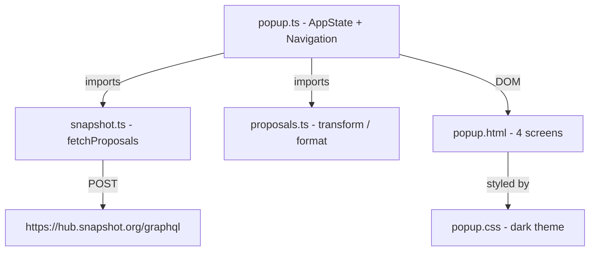
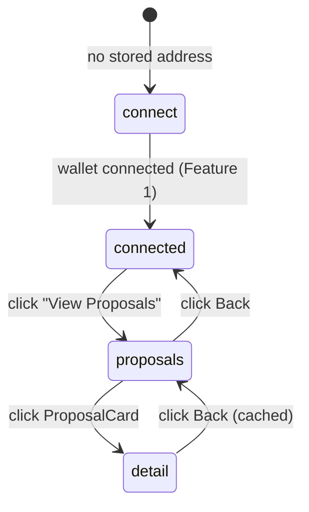

# Design Document: DAO Proposals Display

## Overview

Feature 2 adds proposal browsing to the Snapshot Governance Extension. When a connected user clicks "View Proposals", the popup fetches the 20 most recent proposals from the Snapshot GraphQL API and renders them in a scrollable dark-themed list (Screen 3). Tapping a card navigates to a full detail view (Screen 4) with disabled vote buttons. All changes are additive — Feature 1 files are untouched except for permitted HTML/CSS extensions to `popup/popup.html` and `popup/popup.css`.

Two new source files are introduced: `src/snapshot.ts` (API layer) and `src/proposals.ts` (data transformation). Navigation state is managed by an `appState` object and a small set of functions added to `src/popup.ts`.

## Architecture



### Screen Flow



### Build Pipeline

esbuild bundles `src/popup.ts` (which imports `snapshot.ts` and `proposals.ts`) into `dist/popup.js`. No new entry points are needed.

## Components and Interfaces

### `src/snapshot.ts`

Single exported function. No classes, no state.

```typescript
export interface RawProposal {
  id: string;
  title: string;
  body: string;
  choices: string[];
  start: number;
  end: number;
  state: string;           // "active" | "pending" | "closed"
  scores: number[];
  scores_total: number;
  space: { id: string; name: string };
}

export async function fetchProposals(space: string): Promise<RawProposal[]>
```

Sends a single POST to `https://hub.snapshot.org/graphql` with `Content-Type: application/json`. Requests 20 proposals ordered by `created` descending. Throws on non-200 HTTP status or GraphQL `errors` field.

### `src/proposals.ts`

Pure transformation functions. No I/O, no side effects.

```typescript
export interface DisplayProposal {
  id: string;
  title: string;           // truncated to 80 chars
  bodyPreview: string;     // plain text, 200 chars
  bodyDetail: string;      // plain text, 1000 chars
  choices: string[];
  percentages: number[];   // parallel array, rounded to 1 decimal
  scores_total: number;
  state: string;
  timeLabel: string;
  spaceName: string;
}

export function stripMarkdown(text: string): string
export function formatTime(unixTimestamp: number, state: string): string
export function calcPercentages(scores: number[], scores_total: number): number[]
export function transformProposal(raw: RawProposal | null | undefined): DisplayProposal | null
export function formatNumber(n: number): string
```

### `src/popup.ts` additions

```typescript
// State
const appState = {
  screen: 'connect' as 'connect' | 'connected' | 'proposals' | 'detail',
  proposals: [] as DisplayProposal[],
  selectedProposal: null as DisplayProposal | null,
  address: ''
};
let isLoadingProposals = false;

// Navigation
function hideAllScreens(): void
function renderCurrentScreen(): void
function navigate(screen: AppScreen, data?: { proposal?: DisplayProposal }): void

// Renderers
function renderProposalCards(proposals: DisplayProposal[]): void
function renderProposalDetail(proposal: DisplayProposal): void
```

The existing `showState()` / `showConnected()` / `initialize()` functions are preserved unchanged. The new `navigate()` function replaces direct `showState()` calls for the two new screens only.

## Data Models

### AppState

```typescript
type AppScreen = 'connect' | 'connected' | 'proposals' | 'detail';

const appState: {
  screen: AppScreen;
  proposals: DisplayProposal[];
  selectedProposal: DisplayProposal | null;
  address: string;
}
```

### GraphQL Query

```graphql
query Proposals($space: String!) {
  proposals(
    first: 20
    skip: 0
    where: { space: $space }
    orderBy: "created"
    orderDirection: desc
  ) {
    id title body choices start end state
    scores scores_total
    space { id name }
  }
}
```

### Top-2 Choices Sort

```typescript
const pairs = choices.map((c, i) => ({ choice: c, percent: percentages[i] || 0 }));
pairs.sort((a, b) => b.percent - a.percent);
const topTwo = pairs.slice(0, 2);
```

## HTML Structure (additive)

New elements added to `popup/popup.html` — existing Feature 1 markup is untouched.

```html
<!-- Screen 3: Proposals List -->
<div id="screen-proposals" class="screen" style="display:none">
  <div class="screen-header">
    <button id="btn-back-proposals" class="back-btn">←</button>
    <span class="screen-title">Proposals</span>
  </div>
  <div id="proposals-loading" class="hidden">Loading…</div>
  <div id="proposals-empty"  class="hidden">No proposals found.</div>
  <div id="proposals-error"  class="hidden">
    <p id="proposals-error-msg"></p>
    <button id="btn-retry">Retry</button>
  </div>
  <div id="proposals-list" class="proposals-list"></div>
</div>

<!-- Screen 4: Proposal Detail -->
<div id="screen-detail" class="screen" style="display:none">
  <div class="screen-header">
    <button id="btn-back-detail" class="back-btn">←</button>
    <span class="screen-title">Detail</span>
  </div>
  <div id="detail-content"></div>
</div>
```

A `btn-proposals` button is added inside the existing `#connected-state` div:

```html
<button id="btn-proposals" class="proposals-button">View Proposals</button>
```

## Navigation Implementation

```typescript
function hideAllScreens(): void {
  document.querySelectorAll('.screen').forEach(el => {
    (el as HTMLElement).style.display = 'none';
  });
}

function renderCurrentScreen(): void {
  hideAllScreens();
  switch (appState.screen) {
    case 'connect':
      showConnectScreen();
      break;
    case 'connected':
      showConnectedScreen(appState.address);
      break;
    case 'proposals':
      document.getElementById('screen-proposals')!.style.display = 'block';
      break;
    case 'detail':
      document.getElementById('screen-detail')!.style.display = 'block';
      if (!appState.selectedProposal) return;
      renderProposalDetail(appState.selectedProposal);
      break;
  }
}

function navigate(screen: AppScreen, data?: { proposal?: DisplayProposal }): void {
  appState.screen = screen;
  if (data?.proposal) appState.selectedProposal = data.proposal;
  renderCurrentScreen();
}
```

## Proposal Card Rendering

```typescript
function renderProposalCards(proposals: DisplayProposal[]): void {
  const list = document.getElementById('proposals-list')!;
  list.innerHTML = '';                          // safe — clearing container only, no API data
  const safeProposals = proposals.filter(Boolean); // filter out any null results
  if (!safeProposals.length) { showProposalsEmpty(); return; }
  const frag = document.createDocumentFragment();

  for (const p of proposals) {
    const card = document.createElement('div');
    card.className = 'proposal-card';
    card.onclick = () => navigate('detail', { proposal: p });

    // Status badge
    const badge = document.createElement('span');
    badge.className = `badge badge-${p.state}`;
    badge.textContent = p.state;               // textContent only

    // Space + title
    const space = document.createElement('p');
    space.className = 'card-space';
    space.textContent = p.spaceName;

    const title = document.createElement('p');
    title.className = 'card-title';
    title.textContent = p.title;

    // When scores_total > 0: top-2 sorted by percentage (sorted rank, not original index)
    if (p.scores_total > 0) {
      const pairs = p.choices.map((c, i) => ({ choice: c, percent: p.percentages[i] || 0 }));
      pairs.sort((a, b) => b.percent - a.percent);
      const topTwo = pairs.slice(0, 2);
      const colors = ['green', 'red']; // applied by sorted rank, not original index

      topTwo.forEach(({ choice, percent }, idx) => {
        const row = document.createElement('div');
        row.className = 'choice-row';

        const label = document.createElement('span');
        label.className = `choice-label color-${colors[idx]}`;
        label.textContent = `${choice}: ${percent}%`;

        const bar = document.createElement('div');
        bar.className = 'progress-bar';
        const fill = document.createElement('div');
        fill.className = `progress-fill fill-${colors[idx]}`;
        fill.style.width = `${percent}%`;
        bar.appendChild(fill);

        row.appendChild(label);
        row.appendChild(bar);
        card.appendChild(row);
      });
    }

    // Time label
    const time = document.createElement('p');
    time.className = 'card-time';
    time.textContent = p.timeLabel;

    card.appendChild(badge);
    card.appendChild(space);
    card.appendChild(title);
    card.appendChild(time);
    frag.appendChild(card);
  }

  list.appendChild(frag);
}
```

## Proposal Detail Rendering

```typescript
function renderProposalDetail(proposal: DisplayProposal): void {
  const container = document.getElementById('detail-content')!;
  container.innerHTML = '';                     // safe — clearing container only

  // Guard: skip if choices[i] or scores[i] undefined for any entry
  // Colors applied by sorted rank: index 0 → green, index 1 → red, rest → grey
  // All text assigned via textContent — never innerHTML for API data
}
```

Progress bar widths use `fill.style.width = \`${proposal.percentages[i]}%\``. Colors: index 0 → green, index 1 → red, rest → grey.

## Data Transformation Details

### `stripMarkdown(text)`

Removes: `##` headings, `**bold**`, `` `code` ``, `> blockquotes`, `[text](url)` links. Returns plain text string.

### `formatTime(unixTimestamp, state)`

| state | condition | output |
|-------|-----------|--------|
| `active` | > 1 day remaining | `"Ends in Xd Xh"` |
| `active` | > 1 hour remaining | `"Ends in Xh"` |
| `active` | < 1 hour remaining | `"Ending soon"` |
| `pending` | > 1 day remaining | `"Starts in Xd Xh"` |
| `pending` | > 1 hour remaining | `"Starts in Xh"` |
| `pending` | < 1 hour remaining | `"Starting soon"` |
| `closed` | > 1 day ago | `"Ended Xd ago"` |
| `closed` | > 1 hour ago | `"Ended Xh ago"` |
| `closed` | < 1 hour ago | `"Just ended"` |

### `calcPercentages(scores, scores_total)`

Returns `[]` when `scores_total` is 0 or falsy. Otherwise returns `scores.map(s => Math.round((s / scores_total) * 100))`. Percentages are rounded to the nearest integer.

### `transformProposal(raw)`

```typescript
if (!raw) return null;
return {
  id: raw.id,
  title: raw.title.slice(0, 80),
  bodyPreview: stripMarkdown(raw.body).slice(0, 200),
  bodyDetail: stripMarkdown(raw.body).slice(0, 1000),
  choices: raw.choices,
  percentages: calcPercentages(raw.scores, raw.scores_total),
  scores_total: raw.scores_total,
  state: raw.state,
  timeLabel: formatTime(raw.end, raw.state),
  spaceName: raw.space.name
};
```

## Error Handling

| Scenario | Behavior |
|----------|----------|
| HTTP non-200 | `fetchProposals` throws `"HTTP error: {status}"` |
| GraphQL errors field | `fetchProposals` throws first error message |
| Network failure | catch in popup, show `proposals-error` with message |
| Zero proposals returned | show `proposals-empty` |
| `transformProposal(null)` | returns `null`, filtered out before render |
| Double-click "View Proposals" | `isLoadingProposals` guard (debounce) prevents second fetch |
| `isLoadingProposals` reset | always reset in `finally` block — never left `true` on early return |
| Back from detail | uses `appState.proposals` cache, no re-fetch |
| `null` in proposals array | filtered with `proposals.filter(Boolean)` before render |

## Visual Design

### Color Palette

```css
/* Backgrounds */
--bg-main:   #0d0d1a;
--bg-card:   #1e1e3a;
--bg-header: #12122a;

/* Borders */
--border-card: 1px solid rgba(255,255,255,0.08);

/* Status badges */
--badge-active:  #00ff88;   /* green */
--badge-pending: #f59e0b;   /* amber */
--badge-closed:  #6b7280;   /* grey */

/* Progress fills */
--fill-green: #00ff88;
--fill-red:   #EF0606;
--fill-grey:  #4b5563;

/* Text */
--text-primary:   #e2e8f0;
--text-secondary: #94a3b8;
--text-mono:      'Monaco', 'Menlo', monospace;
```

### Layout

- Popup body: `width: 350px`, `height: 500px` (fixed), `overflow: hidden`
- `#screen-proposals`, `#screen-detail`: `height: 100%`, `display: flex`, `flex-direction: column`
- `#proposals-list`: `flex: 1`, `overflow-y: auto` — enables scrolling without resizing popup
- `detail-content`: `flex: 1`, `overflow-y: auto`
- ProposalCard: `background: var(--bg-card)`, `border-radius: 8px`, `padding: 12px`, `margin-bottom: 8px`, `cursor: pointer`
- Badge: `border: 1px solid <color>`, `border-radius: 4px`, `padding: 2px 6px`, `font-size: 11px`
- Progress bar track: `height: 4px`, `background: #2d2d4a`, `border-radius: 2px`
- Vote buttons: `opacity: 0.4`, `cursor: not-allowed`, `pointer-events: none`

## Testing Strategy

### Unit Tests

Focus on the pure functions in `src/proposals.ts` — these are the most testable and highest-value:

- `stripMarkdown`: verify `##`, `**`, backtick, `>`, and `[text](url)` patterns are removed
- `calcPercentages`: verify zero-division guard, rounding to 1 decimal, correct proportions
- `formatTime`: verify each state/time-remaining branch produces correct label
- `transformProposal`: verify null guard, field truncation lengths, field mapping
- `formatNumber`: verify locale separator output

### Integration Tests

- `fetchProposals`: mock `fetch`, verify correct GraphQL query body, headers, error throwing on non-200 and on `errors` field
- Navigation: verify `hideAllScreens` hides all `.screen` elements, `navigate` updates `appState` and shows correct screen

### Manual Smoke Tests

1. Load extension with connected wallet → click "View Proposals" → proposals list appears
2. Click a proposal card → detail screen appears with correct content
3. Click back from detail → proposals list reappears (no loading spinner)
4. Click back from proposals → connected screen appears
5. Verify no `innerHTML` assignments for proposal content (CSP compliance)
6. Verify long proposal body is truncated at 1000 chars in detail view
