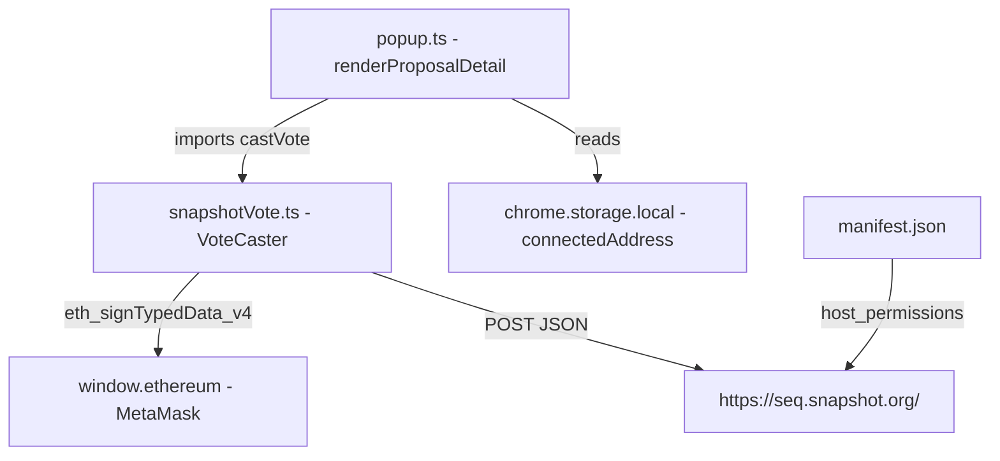
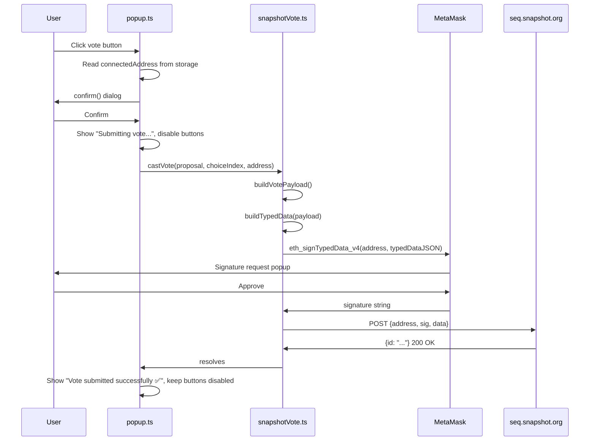

# Design Document: Snapshot Vote Casting (EIP-712)

## Overview

Feature 5 adds off-chain governance voting to the GovernCrypto Chrome extension. A user viewing an active proposal can click a choice button, confirm their selection, sign the vote via MetaMask's `eth_signTypedData_v4`, and submit it to the Snapshot sequencer relay at `https://seq.snapshot.org/`. No blockchain transaction is required.

The implementation is purely additive:

- **New file**: `src/snapshotVote.ts` — the VoteCaster module (payload construction, signing, submission)
- **Modified file**: `src/popup.ts` — vote button activation and UI state management in `renderProposalDetail()`
- **Modified file**: `manifest.json` — add `"https://seq.snapshot.org/*"` to `host_permissions`

No changes to `storage.ts`, `snapshot.ts`, or `proposals.ts`.

## Architecture



### Vote Flow



### Build Pipeline

esbuild bundles `src/popup.ts` (which imports `snapshotVote.ts`) into `dist/popup.js`. No new entry points are needed.

## Components and Interfaces

### `src/snapshotVote.ts`

The VoteCaster module. Pure functions plus one top-level `castVote` orchestrator. No classes, no module-level state.

```typescript
// The structured vote payload sent to Snapshot
export interface VotePayload {
  from: string;       // voter's Ethereum address
  space: string;      // Snapshot space ID (e.g. "ens.eth")
  timestamp: number;  // Unix seconds
  proposal: string;   // Snapshot proposal ID (bytes32 hex)
  choice: number;     // 1-based index into proposal.choices[]
  reason: string;     // always "" for this feature
  app: string;        // always "govercrypto"
  metadata: string;   // always "{}"
  type: string;       // always "vote"
}

// EIP-712 typed data structure
export interface TypedData {
  domain: {
    name: string;           // "snapshot"
    version: string;        // "0.1.4"
    chainId: number;        // 1 (Ethereum mainnet)
    verifyingContract: string; // "0xC4cDb...snapshot relay"
  };
  types: {
    Vote: Array<{ name: string; type: string }>;
  };
  message: VotePayload;
}

/**
 * Builds the Vote_Payload from proposal context and user choice.
 * Pure function — no I/O.
 */
export function buildVotePayload(
  proposalId: string,
  spaceId: string,
  choiceIndex: number,   // 1-based
  voterAddress: string
): VotePayload

/**
 * Wraps a VotePayload in the EIP-712 TypedData envelope.
 * Pure function — no I/O.
 */
export function buildTypedData(payload: VotePayload): TypedData

/**
 * Orchestrates the full vote flow: build → sign → submit.
 * Throws descriptive errors on each failure mode.
 */
export async function castVote(
  proposalId: string,
  spaceId: string,
  choiceIndex: number,   // 1-based
  voterAddress: string
): Promise<void>
```

#### EIP-712 Domain Constants

Snapshot's off-chain voting uses a fixed domain. These are hardcoded constants in `snapshotVote.ts`:

```typescript
const SNAPSHOT_DOMAIN = {
  name: 'snapshot',
  version: '0.1.4',
  chainId: 1,
  verifyingContract: '0xC4cDb0a651724D7DB1b3b2F08b8bF61b5a33952D'
};

const VOTE_TYPE = [
  { name: 'from',      type: 'address' },
  { name: 'space',     type: 'string'  },
  { name: 'timestamp', type: 'uint64'  },
  { name: 'proposal',  type: 'bytes32' },
  { name: 'choice',    type: 'uint32'  },
  { name: 'reason',    type: 'string'  },
  { name: 'app',       type: 'string'  },
  { name: 'metadata',  type: 'string'  },
];
```

#### Signing

```typescript
const typedDataJSON = JSON.stringify(typedData);
const signature = await (window.ethereum as any).request({
  method: 'eth_signTypedData_v4',
  params: [voterAddress, typedDataJSON]
});
```

Error mapping:
- `window.ethereum` is `undefined` → throw `new Error("No wallet provider found")`
- MetaMask rejects (error code `4001`) → throw `new Error("Signature rejected")`

#### Submission

```typescript
const response = await fetch('https://seq.snapshot.org/', {
  method: 'POST',
  headers: { 'Content-Type': 'application/json' },
  body: JSON.stringify({ address: voterAddress, sig: signature, data: typedData })
});
```

Error mapping:
- `fetch` throws (network error) → throw `new Error("Network error. Please try again.")`
- Response not ok → throw `new Error(\`Relay error \${response.status}: \${body}\`)`
- Response body contains `"already voted"` → throw `new Error("You have already voted on this proposal")`

### `src/popup.ts` — `renderProposalDetail` changes

The vote buttons section is the only part of `popup.ts` that changes. The diff is:

**Before:**
```typescript
proposal.choices.forEach(choice => {
  if (!choice) return;
  const btn = document.createElement('button');
  btn.className = 'vote-btn';
  btn.textContent = choice;
  btn.disabled = true;
  voteButtons.appendChild(btn);
});
container.appendChild(voteButtons);

const note = document.createElement('p');
note.className = 'vote-note';
note.textContent = 'Voting coming in next update';
container.appendChild(note);
```

**After:**
```typescript
const isActive = proposal.state === 'active';

proposal.choices.forEach((choice, idx) => {
  if (!choice) return;
  const btn = document.createElement('button');
  btn.className = 'vote-btn';
  btn.textContent = choice;
  btn.disabled = !isActive;

  if (isActive) {
    btn.addEventListener('click', () => handleVoteClick(proposal, idx + 1, voteButtons, voteStatus));
  }
  voteButtons.appendChild(btn);
});
container.appendChild(voteButtons);

// Status message element (replaces the "Voting coming in next update" note)
const voteStatus = document.createElement('p');
voteStatus.className = 'vote-status';
voteStatus.textContent = '';
container.appendChild(voteStatus);
```

The `handleVoteClick` function is added to `popup.ts`:

```typescript
async function handleVoteClick(
  proposal: DisplayProposal,
  choiceIndex: number,
  buttonsContainer: HTMLElement,
  statusEl: HTMLElement
): Promise<void> {
  // 1. Guard: wallet must be connected
  const result = await chrome.storage.local.get('connectedAddress');
  const address: string | undefined = result.connectedAddress;
  if (!address) {
    statusEl.textContent = 'Connect wallet first';
    return;
  }

  // 2. Confirmation dialog
  const choiceName = proposal.choices[choiceIndex - 1];
  const confirmed = window.confirm(`Vote "${choiceName}" on "${proposal.title}"?`);
  if (!confirmed) return;

  // 3. Disable all buttons + show in-progress status
  setVoteButtons(buttonsContainer, true);
  statusEl.textContent = 'Submitting vote...';

  try {
    await castVote(proposal.id, proposal.spaceId, choiceIndex, address);
    statusEl.textContent = 'Vote submitted successfully ✅';
    // Keep buttons disabled after success
  } catch (err: unknown) {
    const msg = err instanceof Error ? err.message : 'Vote failed. Please try again.';
    if (msg === 'Signature rejected') {
      statusEl.textContent = 'Signature rejected';
    } else if (msg.includes('already voted')) {
      statusEl.textContent = 'You have already voted on this proposal';
      // Keep buttons disabled — already voted
      return;
    } else {
      statusEl.textContent = 'Vote failed. Please try again.';
    }
    // Re-enable buttons on recoverable errors
    setVoteButtons(buttonsContainer, false);
  }
}

function setVoteButtons(container: HTMLElement, disabled: boolean): void {
  container.querySelectorAll<HTMLButtonElement>('.vote-btn').forEach(btn => {
    btn.disabled = disabled;
  });
}
```

### `manifest.json` change

Add `"https://seq.snapshot.org/*"` to `host_permissions`:

```json
"host_permissions": [
  "https://api.mistral.ai/*",
  "https://api.elevenlabs.io/*",
  "https://seq.snapshot.org/*"
]
```

## Data Models

### VotePayload (sent to Snapshot relay)

| Field | Type | Value |
|-------|------|-------|
| `from` | `address` | `connectedAddress` from storage |
| `space` | `string` | `proposal.spaceId` |
| `timestamp` | `uint64` | `Math.floor(Date.now() / 1000)` |
| `proposal` | `bytes32` | `proposal.id` |
| `choice` | `uint32` | 1-based index of selected choice |
| `reason` | `string` | `""` |
| `app` | `string` | `"govercrypto"` |
| `metadata` | `string` | `"{}"` |
| `type` | `string` | `"vote"` |

### Relay Request Body

```json
{
  "address": "0xABC...",
  "sig": "0xDEF...",
  "data": { /* TypedData object */ }
}
```

### Relay Success Response

```json
{ "id": "vote:0x..." }
```

### Relay Error Response (already voted)

```json
{ "error": "already voted" }
```

## Correctness Properties

*A property is a characteristic or behavior that should hold true across all valid executions of a system — essentially, a formal statement about what the system should do. Properties serve as the bridge between human-readable specifications and machine-verifiable correctness guarantees.*

### Property 1: Vote payload contains all required fields

*For any* valid combination of proposalId, spaceId, choiceIndex, and voterAddress, `buildVotePayload()` SHALL return an object containing all five required fields (`proposal`, `space`, `choice`, `from`, `timestamp`) with the choice set to the 1-based index and the type set to `"vote"` and app set to `"govercrypto"`.

**Validates: Requirements 1.1, 1.2, 1.3**

### Property 2: EIP-712 typed data structure is always valid

*For any* valid `VotePayload`, `buildTypedData()` SHALL return a `TypedData` object whose `domain` contains `name`, `version`, `chainId`, and `verifyingContract`, and whose `types.Vote` array contains entries for all eight fields: `from`, `space`, `timestamp`, `proposal`, `choice`, `reason`, `app`, and `metadata`.

**Validates: Requirements 1.4, 1.5**

### Property 3: Typed data is not mutated between signing and submission

*For any* vote flow that completes successfully, the `TypedData` object passed to `eth_signTypedData_v4` SHALL be deep-equal to the `data` field in the body sent to `https://seq.snapshot.org/`.

**Validates: Requirements 3.3, 8.3**

### Property 4: Submission request always contains address, sig, and data

*For any* valid (voterAddress, signature, typedData) triple, `submitVote()` SHALL call `fetch` with a POST body that contains `address`, `sig`, and `data` fields.

**Validates: Requirements 3.1**

### Property 5: Active proposals render enabled vote buttons

*For any* active `DisplayProposal` with N non-empty choices, `renderProposalDetail()` SHALL produce exactly N vote buttons that are not disabled.

**Validates: Requirements 4.1**

### Property 6: Non-active proposals render disabled vote buttons

*For any* `DisplayProposal` with state `"closed"` or `"pending"` and N non-empty choices, `renderProposalDetail()` SHALL produce exactly N vote buttons that are all disabled.

**Validates: Requirements 4.2, 6.6**

### Property 7: Unhandled errors always produce a safe UI state

*For any* error thrown during the vote flow (signing or submission), `handleVoteClick()` SHALL catch the error, display a non-empty status message, and leave the extension panel in a non-frozen, interactive state with vote buttons re-enabled (unless the error is "already voted").

**Validates: Requirements 6.5**

## Error Handling

| Scenario | VoteCaster behavior | UI behavior |
|----------|--------------------|----|
| `window.ethereum` undefined | throws `"No wallet provider found"` | shows `"Vote failed. Please try again."`, re-enables buttons |
| User rejects MetaMask popup | throws `"Signature rejected"` | shows `"Signature rejected"`, re-enables buttons |
| Network error during fetch | throws `"Network error. Please try again."` | shows `"Vote failed. Please try again."`, re-enables buttons |
| Relay returns non-2xx | throws `"Relay error {status}: {body}"` | shows `"Vote failed. Please try again."`, re-enables buttons |
| Relay returns "already voted" | throws `"You have already voted on this proposal"` | shows `"You have already voted on this proposal"`, keeps buttons disabled |
| No `connectedAddress` in storage | (not reached) | shows `"Connect wallet first"`, no signing initiated |
| User cancels confirm() | (not reached) | returns to idle, no signing initiated |
| Unhandled exception | (propagates) | caught by try/catch in `handleVoteClick`, shows fallback message |

## Testing Strategy

### Unit Tests

Focus on the pure functions in `src/snapshotVote.ts`:

- `buildVotePayload`: verify all fields are set correctly, choice is 1-based, type is `"vote"`, app is `"govercrypto"`
- `buildTypedData`: verify domain fields, verify `types.Vote` contains all 8 required field names
- `castVote` with mocked `window.ethereum`: verify `eth_signTypedData_v4` is called (not `personal_sign`), verify correct params
- `castVote` error paths: no provider → `"No wallet provider found"`, rejection → `"Signature rejected"`, network error → `"Network error. Please try again."`, non-2xx → error with status, already voted → specific message

Focus on `renderProposalDetail` changes in `popup.ts`:

- Active proposal: all buttons enabled, no "Voting coming in next update" text
- Closed/pending proposal: all buttons disabled
- `handleVoteClick` with mocked `castVote`: confirm cancel → no signing; success → success message + buttons disabled; error → error message + buttons re-enabled

### Property-Based Tests

Use [fast-check](https://github.com/dubzzz/fast-check) (TypeScript-native PBT library). Each property test runs a minimum of 100 iterations.

**Property 1 test** — `buildVotePayload` field completeness:
```
// Feature: snapshot-vote-casting, Property 1: Vote payload contains all required fields
fc.assert(fc.property(
  fc.string(), fc.string(), fc.integer({min: 1, max: 100}), fc.hexaString({minLength: 40, maxLength: 40}).map(s => '0x' + s),
  (proposalId, spaceId, choiceIndex, address) => {
    const payload = buildVotePayload(proposalId, spaceId, choiceIndex, address);
    return payload.proposal === proposalId
      && payload.space === spaceId
      && payload.choice === choiceIndex
      && payload.from === address
      && typeof payload.timestamp === 'number'
      && payload.type === 'vote'
      && payload.app === 'govercrypto';
  }
), { numRuns: 100 });
```

**Property 2 test** — `buildTypedData` structure:
```
// Feature: snapshot-vote-casting, Property 2: EIP-712 typed data structure is always valid
fc.assert(fc.property(
  arbitraryVotePayload(),
  (payload) => {
    const td = buildTypedData(payload);
    const domainKeys = ['name', 'version', 'chainId', 'verifyingContract'];
    const voteFields = ['from', 'space', 'timestamp', 'proposal', 'choice', 'reason', 'app', 'metadata'];
    return domainKeys.every(k => k in td.domain)
      && voteFields.every(f => td.types.Vote.some(t => t.name === f));
  }
), { numRuns: 100 });
```

**Property 3 test** — typed data immutability:
```
// Feature: snapshot-vote-casting, Property 3: Typed data is not mutated between signing and submission
fc.assert(fc.property(
  arbitraryVotePayload(),
  async (payload) => {
    const td = buildTypedData(payload);
    const tdBefore = JSON.stringify(td);
    // mock ethereum + fetch, capture what was sent to fetch
    const sentData = await captureSubmissionData(td, payload.from, 'mock-sig');
    return JSON.stringify(sentData) === tdBefore;
  }
), { numRuns: 100 });
```

**Property 4 test** — submission body structure:
```
// Feature: snapshot-vote-casting, Property 4: Submission request always contains address, sig, and data
fc.assert(fc.property(
  fc.hexaString({minLength: 40, maxLength: 40}).map(s => '0x' + s),
  fc.hexaString({minLength: 130, maxLength: 132}).map(s => '0x' + s),
  arbitraryTypedData(),
  async (address, sig, td) => {
    const body = await captureSubmitBody(address, sig, td);
    return 'address' in body && 'sig' in body && 'data' in body;
  }
), { numRuns: 100 });
```

**Property 5 test** — active proposals render enabled buttons:
```
// Feature: snapshot-vote-casting, Property 5: Active proposals render enabled vote buttons
fc.assert(fc.property(
  arbitraryActiveProposal(),
  (proposal) => {
    renderProposalDetail(proposal);
    const buttons = document.querySelectorAll<HTMLButtonElement>('.vote-btn');
    return buttons.length === proposal.choices.filter(Boolean).length
      && Array.from(buttons).every(b => !b.disabled);
  }
), { numRuns: 100 });
```

**Property 6 test** — non-active proposals render disabled buttons:
```
// Feature: snapshot-vote-casting, Property 6: Non-active proposals render disabled vote buttons
fc.assert(fc.property(
  arbitraryNonActiveProposal(),
  (proposal) => {
    renderProposalDetail(proposal);
    const buttons = document.querySelectorAll<HTMLButtonElement>('.vote-btn');
    return buttons.length === proposal.choices.filter(Boolean).length
      && Array.from(buttons).every(b => b.disabled);
  }
), { numRuns: 100 });
```

**Property 7 test** — unhandled errors produce safe UI state:
```
// Feature: snapshot-vote-casting, Property 7: Unhandled errors always produce a safe UI state
fc.assert(fc.property(
  fc.string({minLength: 1}),
  async (errorMessage) => {
    mockCastVoteToThrow(new Error(errorMessage));
    await handleVoteClick(activeProposal, 1, buttonsContainer, statusEl);
    const buttons = document.querySelectorAll<HTMLButtonElement>('.vote-btn');
    return statusEl.textContent!.length > 0
      && (errorMessage.includes('already voted') || Array.from(buttons).every(b => !b.disabled));
  }
), { numRuns: 100 });
```

### Manual Smoke Tests

1. Load extension with connected wallet → open active proposal → vote buttons are enabled
2. Click a vote button → confirm dialog appears with choice name and proposal title
3. Cancel confirm → no MetaMask popup, buttons remain enabled
4. Click vote button → confirm → MetaMask popup appears requesting `eth_signTypedData_v4`
5. Reject in MetaMask → `"Signature rejected"` shown, buttons re-enabled
6. Approve in MetaMask → `"Submitting vote..."` shown briefly → `"Vote submitted successfully ✅"`, buttons disabled
7. Open closed proposal → vote buttons are disabled, no "Voting coming in next update" text for active proposals
8. Open extension with no wallet connected → click vote button → `"Connect wallet first"` shown
9. Verify `manifest.json` contains `"https://seq.snapshot.org/*"` in `host_permissions`
