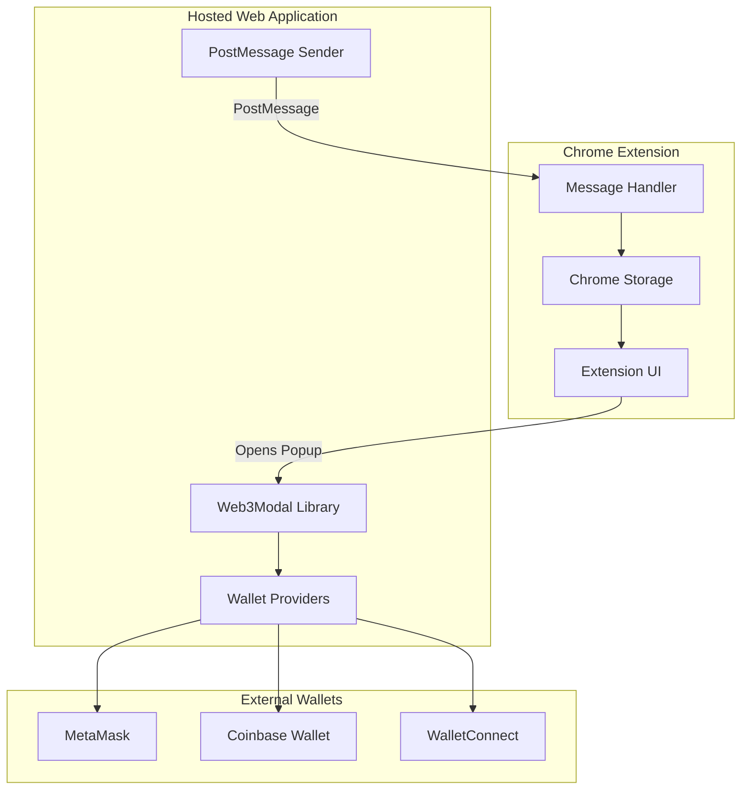

# Design Document

## Overview

The Wallet Connection via Hosted Web3Modal feature implements a secure wallet connection system for a Chrome Extension using a two-component architecture: a Chrome Extension (Manifest V3) that provides the user interface and local storage, and a hosted web application that handles Web3Modal wallet interactions. The system uses cross-origin messaging to securely transfer wallet addresses from the hosted page to the extension while maintaining strict security validation.

The design addresses the challenge of Web3 wallet integration in Chrome Extensions by leveraging a hosted dApp approach, which allows full access to Web3Modal functionality while maintaining the extension's security boundaries. The architecture ensures that wallet connections are handled by a trusted external page while the extension manages persistence and UI state.

## Architecture

### High-Level Architecture

The system consists of two primary components communicating via the PostMessage API:



### Component Interaction Flow

1. **Initiation**: User clicks "Connect Wallet" in extension UI
2. **Popup Creation**: Extension opens hosted page in centered popup window
3. **Wallet Selection**: User selects wallet provider on hosted page
4. **Connection**: Web3Modal handles wallet connection process
5. **Address Retrieval**: Hosted page obtains wallet address from connected wallet
6. **Secure Transfer**: Hosted page sends address via PostMessage to extension
7. **Validation**: Extension validates origin and address format
8. **Persistence**: Extension stores validated address in chrome.storage.local
9. **UI Update**: Extension updates UI to show connected state
10. **Cleanup**: Hosted page auto-closes popup window

The Extension SHALL NOT directly interact with Web3Modal. All wallet interactions SHALL occur exclusively within the Hosted_Page.

## Components and Interfaces

### Chrome Extension Component

#### Manifest V3 Configuration
```json
{
  "manifest_version": 3,
  "name": "Snapshot Governance Voting Extension",
  "version": "1.0.0",
  "permissions": ["storage"],
  "action": {
    "default_popup": "popup.html"
  },
  "content_security_policy": {
    "extension_pages": "script-src 'self'; object-src 'self'"
  }
}
```

#### Extension UI Interface
- **Popup HTML**: Single-page interface with connection status and controls
- **Connect Button**: Initiates wallet connection flow
- **Disconnect Button**: Clears stored wallet data
- **Address Display**: Shows truncated wallet address when connected
- **Loading State**: Indicates active connection process

#### Storage Interface
```typescript
interface StorageData {
  walletAddress?: string;
  connectionTimestamp?: number;
}

interface StorageAPI {
  setWalletAddress(address: string): Promise<void>;
  getWalletAddress(): Promise<string | null>;
  clearWalletData(): Promise<void>;
}
```

#### Message Handler Interface
```typescript
interface WalletMessage {
  type: 'WALLET_CONNECTED';
  address: string;
  timestamp: number;
}

interface MessageHandler {
  validateOrigin(origin: string): boolean;
  validateAddress(address: string): boolean;
  processWalletMessage(event: MessageEvent): Promise<void>;
  handleConnectionError(): void;
}
```

WHEN a CONNECTION_ERROR message is received, THE Extension SHALL reset the UI to the disconnected state and clear any connecting/loading indicators.
```

### Hosted Web Application Component

#### Web3Modal Configuration
```typescript
interface Web3ModalConfig {
  projectId: string;
  chains: Chain[];
}
```

The Hosted_Page SHALL use a lightweight ethers-based Web3Modal configuration suitable for simple wallet connection without advanced wagmi dependencies.

#### Wallet Provider Interface
```typescript
interface WalletProvider {
  id: string;
  name: string;
  icon: string;
  connector: Connector;
}

interface SupportedProviders {
  metamask: WalletProvider;
  coinbase: WalletProvider;
  walletconnect: WalletProvider;
}
```

#### PostMessage Interface
```typescript
interface PostMessageSender {
  sendWalletAddress(address: string): void;
  sendConnectionError(): void;
  closeWindow(): void;
  validateConnection(): boolean;
}
```

IF the user rejects the wallet connection or closes the wallet provider popup, THEN the Hosted_Page SHALL send a CONNECTION_ERROR message to the Extension before closing.

AFTER successfully sending the wallet address or error message via postMessage, THE Hosted_Page SHALL automatically close the popup window using window.close().

## Data Models

### Wallet Address Model
```typescript
interface WalletAddress {
  address: string;           // Ethereum address (0x + 40 hex chars)
  isValid: boolean;         // Validation status
  truncated: string;        // Display version (0x1234...5678)
}
```

### Connection State Model
```typescript
enum ConnectionState {
  DISCONNECTED = 'disconnected',
  CONNECTING = 'connecting',
  CONNECTED = 'connected',
  ERROR = 'error'
}

interface ConnectionStatus {
  state: ConnectionState;
  address?: string;
  error?: string;
  timestamp?: number;
}
```

### Message Protocol Model
```typescript
interface CrossOriginMessage {
  type: 'WALLET_CONNECTED' | 'CONNECTION_ERROR';
  address?: string;
  timestamp: number;
  source: 'web3modal-host';
}
```

All cross-origin messages SHALL use a flat structure with top-level fields to avoid parsing inconsistencies.

## Error Handling

### Extension Error Handling

#### Origin Validation Errors
- **Invalid Origin**: Log security warning, ignore message
- **Missing Origin**: Reject message, log attempt
- **Spoofed Origin**: Block and report potential security threat

#### Address Validation Errors
- **Invalid Format**: Reject address, show user error
- **Empty Address**: Handle as connection failure
- **Malformed Data**: Log error, maintain current state

#### Storage Errors
- **Storage Quota**: Handle gracefully, notify user
- **Permission Denied**: Fallback to session storage
- **Corruption**: Clear storage, restart connection flow

### Hosted Page Error Handling

#### Web3Modal Errors
- **Provider Unavailable**: Show alternative options
- **Connection Rejected**: Allow retry with clear messaging
- **Network Errors**: Implement retry logic with exponential backoff

#### Wallet Provider Errors
- **MetaMask Not Installed**: Provide installation guidance
- **Coinbase Connection Failed**: Suggest alternative providers
- **WalletConnect Timeout**: Implement connection timeout handling

#### PostMessage Errors
- **Window Closed**: Handle graceful cleanup
- **Message Failed**: Implement retry mechanism
- **Parent Not Available**: Log error, attempt cleanup

## Correctness Properties

*A property is a characteristic or behavior that should hold true across all valid executions of a system-essentially, a formal statement about what the system should do. Properties serve as the bridge between human-readable specifications and machine-verifiable correctness guarantees.*

### Property 1: Ethereum Address Validation

*For any* input string, the address validation function SHALL correctly identify valid Ethereum addresses (0x followed by 40 hexadecimal characters) and reject all invalid formats, ensuring no invalid addresses are stored or displayed

**Validates: Requirements 4.4, 8.2, 8.3, 8.4**

### Property 2: Origin Validation Security

*For any* postMessage event origin, the extension SHALL only accept messages from the predefined trusted domain and reject all other origins, ensuring secure cross-origin communication

**Validates: Requirements 3.5, 4.1, 4.2, 8.1, 8.5**

### Property 3: Address Storage and Display Consistency

*For any* valid wallet address received and stored, the extension SHALL consistently display the connected state, show the address (truncated), and provide disconnect functionality

**Validates: Requirements 5.1, 5.4, 6.2, 6.3, 6.4**

### Property 4: Message Payload Integrity

*For any* valid wallet address obtained from Web3Modal, the hosted page SHALL include that exact address in the postMessage payload sent to the extension

**Validates: Requirements 3.4**

### Property 5: Address Truncation Formatting

*For any* Ethereum wallet address, the truncation function SHALL produce a consistent display format showing the first 6 and last 4 characters with ellipsis (0x1234...5678)

**Validates: Requirements 6.5**

## Testing Strategy

### Unit Testing Approach

For the hackathon MVP, the system SHALL implement basic unit testing and simple error handling. Advanced testing strategies (property-based testing, performance testing) SHALL be deferred to post-MVP development.

The testing strategy focuses on component isolation and integration verification:

#### Extension Component Tests
- **Storage Operations**: Test chrome.storage.local interactions
- **Message Validation**: Verify origin and address validation logic
- **UI State Management**: Test state transitions and display updates
- **Basic Error Handling**: Validate error scenarios and recovery

#### Hosted Page Tests
- **Web3Modal Integration**: Test wallet provider connections
- **PostMessage Functionality**: Verify message sending and formatting
- **Window Management**: Test popup behavior and auto-close
- **Connection Cancellation**: Test error message handling

#### Integration Tests
- **End-to-End Flow**: Complete wallet connection process
- **Cross-Origin Communication**: Message passing between components
- **Security Validation**: Origin checking and address validation
- **Connection Error Recovery**: Failed connection handling

### Testing Configuration

**Unit Tests**: Jest with Chrome Extension testing utilities
**Integration Tests**: Basic cross-component testing
**Security Tests**: Origin and address validation testing

Each test suite will include:
- Positive path validation
- Basic error condition handling
- Security boundary testing