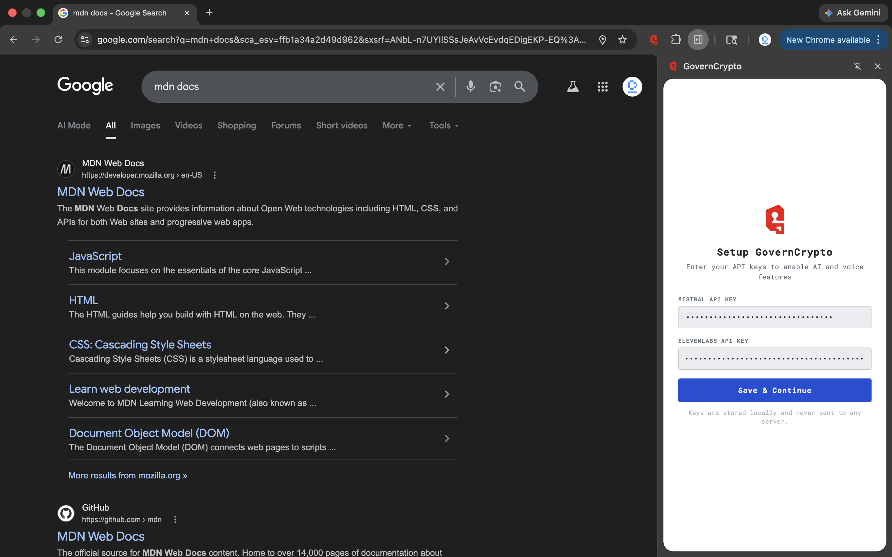
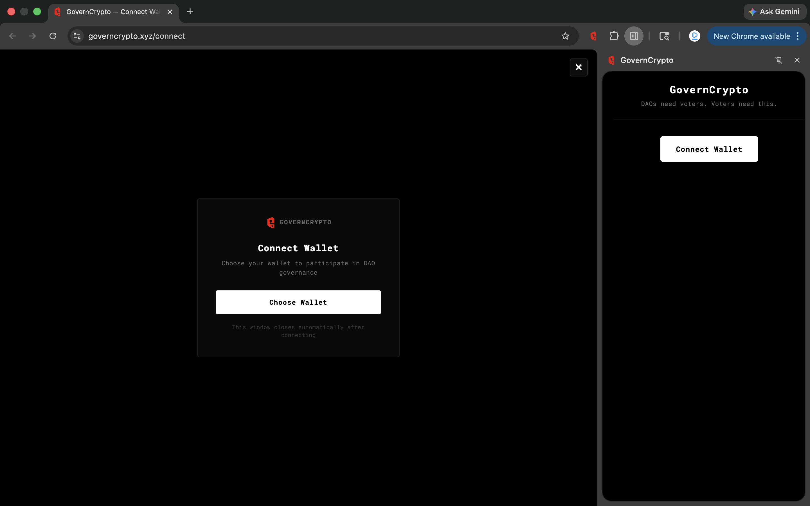
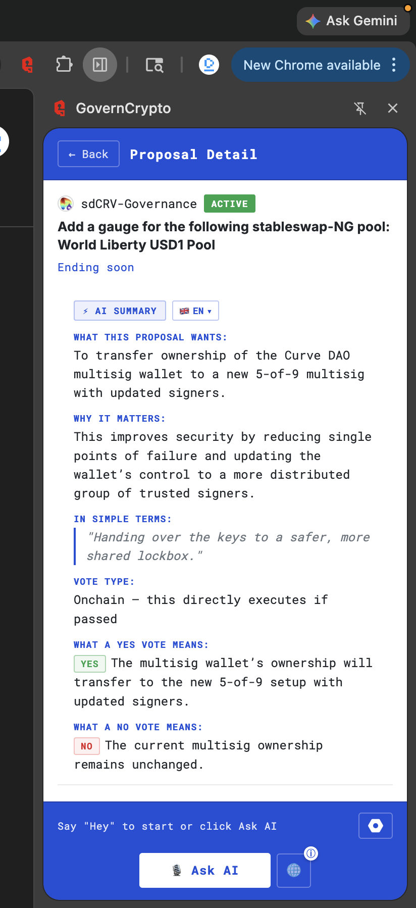
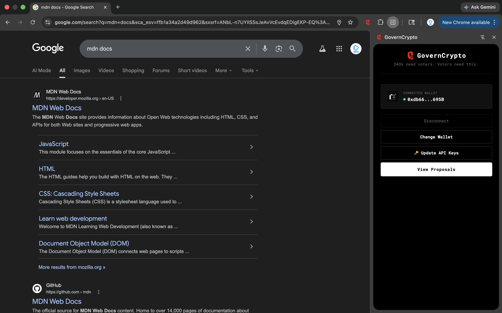
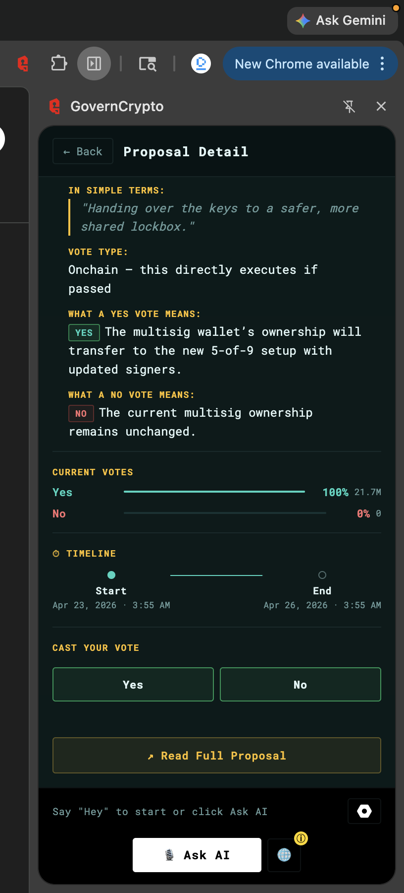
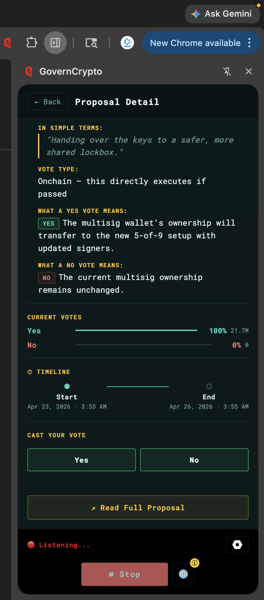
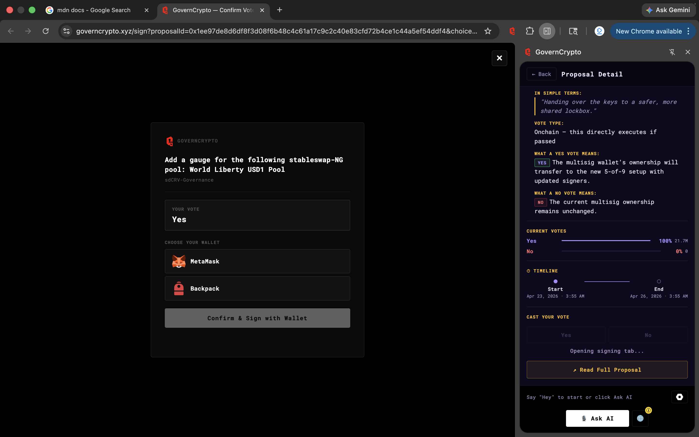

# GovernCrypto — Chrome Extension

> DAOs need voters. Voters need this.

GovernCrypto is a Chrome extension that turns DAO governance into a conversation. Connect your wallet, browse active proposals across 10+ major DAOs, get AI-powered summaries, ask questions by voice, and cast votes — all without leaving your browser.

---

## Features

- **AI Summaries** — Instant Mistral AI summaries of any proposal in 15 languages
- **Voice AI Assistant** — Say "Hey" to ask questions about proposals by voice (ElevenLabs powered)
- **Multi-language Support** — Summaries and voice responses in English, Hindi, Hinglish, Spanish, French, German, Chinese, Japanese, and more
- **Native Accent Voices** — Auto-detects language and uses native speaker voices
- **Wallet Connect** — Connect MetaMask, Backpack, Coinbase or any WalletConnect wallet
- **On-chain Voting** — Cast votes directly via EIP-712 signing through Snapshot
- **10+ DAOs** — ENS, Uniswap, Aave, MakerDAO, Compound, Curve, Balancer, Sushi, Gitcoin, Arbitrum
- **4 Themes** — Dark, Midnight, Ocean, Light
- **Sound Effects** — Professional UI sounds via ElevenLabs
- **Offline Detection** — Banner shown when network is unavailable

---

## Quick Start (Use Directly)

### Prerequisites

- Google Chrome browser
- [Mistral AI API key](https://console.mistral.ai/) — for AI summaries
- [ElevenLabs API key](https://elevenlabs.io/) — for voice features

### Install from GitHub

1. **Clone the repository**
   ```bash
   git clone https://github.com/Codevesh090/GovernCrypto-extension.git
   cd GovernCrypto-extension
   ```

2. **Load the extension in Chrome**
   - Open Chrome and go to `chrome://extensions/`
   - Enable **Developer mode** (top right toggle)
   - Click **Load unpacked**
   - Select the `dist/` folder from the cloned repository

3. **Open the extension**
   - Click the GovernCrypto icon in your Chrome toolbar
   - Or open the side panel via the extensions menu

4. **Enter your API keys**
   - Enter your Mistral API key
   - Enter your ElevenLabs API key
   - Click **Save & Continue**

5. **Connect your wallet**
   - Click **Connect Wallet**
   - Choose your wallet (MetaMask, Backpack, Coinbase, etc.)
   - Your wallet address will appear in the extension

6. **Start exploring**
   - Click **View Proposals** to browse active DAO proposals
   - Click any proposal to see the AI summary
   - Say **"Hey"** to ask questions by voice

---

## Developer Setup

### Requirements

- Node.js 18+
- npm

### Project Structure

```
GovernCrypto-extension/
├── src/                    # Extension source (TypeScript)
│   ├── popup.ts            # Main UI logic
│   ├── background.ts       # Service worker
│   ├── walletBridge.ts     # Content script for wallet sync
│   ├── mistral.ts          # AI summary generation
│   ├── snapshot.ts         # Snapshot GraphQL API
│   ├── snapshotVote.ts     # EIP-712 vote signing
│   ├── voiceTts.ts         # ElevenLabs TTS
│   ├── voiceStt.ts         # Speech recognition
│   ├── voiceConversation.ts# AI voice conversation
│   ├── languageDetection.ts# Auto language detection
│   └── ...
├── popup/                  # Extension popup HTML/CSS
├── hosted-page/            # Wallet connect hosted page (Vite)
│   ├── src/
│   │   ├── main.ts         # WalletConnect Web3Modal
│   │   └── sign.ts         # Vote signing page
│   └── ...
├── public/                 # Deployed to governcrypto.xyz (Vercel)
├── dist/                   # Built extension (load this in Chrome)
├── manifest.json           # Extension manifest
└── package.json
```

### Build the Extension

```bash
# Install dependencies
npm install

# Build the extension
npm run build
```

The built extension will be in the `dist/` folder. Load it in Chrome via `chrome://extensions/` → Load unpacked → select `dist/`.

### Build the Hosted Page

The hosted page (`governcrypto.xyz/connect`) handles wallet connection via Web3Modal.

```bash
cd hosted-page
npm install
npm run build
```

### Deploy the Hosted Page

After building the hosted page, sync it to the `public/` folder (served by Vercel):

```bash
# From the root directory
npm run deploy
```

This command:
1. Builds the hosted page
2. Copies built files to `public/` and `docs/`
3. Updates `public/connect/index.html` (the route Vercel serves)

Then push to GitHub — Vercel auto-deploys from the `public/` folder.

```bash
git add .
git commit -m "deploy: update hosted page"
git push
```

### Local Development

To test wallet connection locally without deploying to Vercel:

1. Start the hosted page dev server:
   ```bash
   cd hosted-page && npm run dev
   ```
   This runs at `http://localhost:3000`

2. In `src/popup.ts`, temporarily change:
   ```typescript
   const HOSTED_PAGE_URL = 'http://localhost:3000';
   const TRUSTED_ORIGIN = 'http://localhost:3000';
   ```

3. In `manifest.json`, add localhost to content scripts:
   ```json
   "matches": ["https://governcrypto.xyz/*", "http://localhost:3000/*"]
   ```

4. Rebuild the extension:
   ```bash
   npm run build
   ```

5. Reload the extension in `chrome://extensions/`

> **Remember** to revert the URLs back to `https://governcrypto.xyz` before deploying to production.

---

## Configuration

### WalletConnect Project ID

The extension uses WalletConnect for wallet connection. The project ID is configured in `hosted-page/src/main.ts`:

```typescript
const PROJECT_ID = 'your_project_id_here'
```

Get your own project ID at [cloud.walletconnect.com](https://cloud.walletconnect.com/).

Add your domain to the WalletConnect Cloud **Allowed Domains** list:
- `https://governcrypto.xyz`
- `https://www.governcrypto.xyz`

### Vercel Deployment

The `vercel.json` routes:
- `/connect` → `public/connect/index.html` (wallet connection page)
- `/sign` → `public/sign/index.html` (vote signing page)

---

## API Keys

| Key | Where to get | Used for |
|-----|-------------|---------|
| Mistral AI | [console.mistral.ai](https://console.mistral.ai/) | AI proposal summaries |
| ElevenLabs | [elevenlabs.io](https://elevenlabs.io/) | Voice TTS + sound effects |

Keys are stored locally in `chrome.storage.local` and never sent to any server other than the respective APIs.

---

## How Wallet Connection Works

```
User clicks "Connect Wallet"
        ↓
Extension opens governcrypto.xyz/connect
        ↓
User selects wallet (MetaMask, WalletConnect, etc.)
        ↓
Wallet connects → address saved to localStorage
        ↓
Content script (walletBridge.js) detects change
        ↓
Writes address to chrome.storage.local
        ↓
Extension popup updates instantly
        ↓
Connect tab closes automatically
```

---

## How Voting Works

```
User clicks a vote button on a proposal
        ↓
Extension opens governcrypto.xyz/sign
        ↓
User selects their wallet
        ↓
EIP-712 typed data is constructed
        ↓
User signs with their wallet
        ↓
Signed vote is submitted to Snapshot relay
        ↓
Vote confirmed on-chain (gasless)
```

---

## Screenshots

### Setup — Enter API Keys


### Connect Wallet


### Connected Wallet


### Proposals List with AI Summary


### Proposal Detail — Dark Theme


### Proposal Detail — Ocean Theme


### Voice AI Assistant — Listening


### Vote Signing Page


---

## Tech Stack

| Layer | Technology |
|-------|-----------|
| Extension | Chrome MV3, TypeScript, esbuild |
| UI | Vanilla TypeScript, CSS variables |
| AI Summaries | Mistral AI (`mistral-small-latest`) |
| Voice TTS | ElevenLabs Streaming API |
| Voice STT | Web Speech API |
| Wallet Connect | Web3Modal v4 + WalletConnect v2 |
| Voting | Snapshot EIP-712 + seq.snapshot.org relay |
| DAO Data | Snapshot GraphQL API |
| Hosting | Vercel (hosted page) |
| Language Detection | franc-min |

---

## Contributing

1. Fork the repository
2. Create a feature branch: `git checkout -b feature/my-feature`
3. Make your changes in `src/`
4. Build: `npm run build`
5. Test by loading `dist/` as unpacked extension
6. Commit and push
7. Open a Pull Request

---

## License

MIT

---

## Links

- **Extension**: Load from `dist/` folder
- **Hosted Page**: [governcrypto.xyz](https://governcrypto.xyz)
- **Snapshot**: [snapshot.org](https://snapshot.org)
- **WalletConnect Cloud**: [cloud.walletconnect.com](https://cloud.walletconnect.com)
